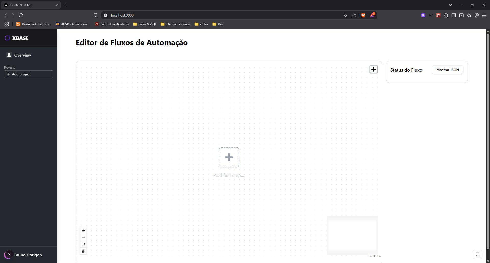

# 🔖 Projeto GR Challenge

Desafio projeto GR Negocios para Desenvolvedor Front End Júnior.

A proposta era desenvolver um editor de fluxos de automações integrado com whatsapp, instagram e uma assistente virtual.

Foi fornecido uma API pública integrada com o banco da GR Negocios Digitais para que possamos integrar nossas aplicações e também para deixar no padrão da API.

# 🚀 Tecnologias

- TypeScript
- NextJS
- Shadcn/UI
- Context API
- React Flow
- Axios
- React Hot Toast

# 📙 Rodando Projeto

```
git clone  https://github.com/DorigonBruno/xbase.git
```

```
npm install
```

```
npm run dev
```


Clicamos no local host para ver o projeto.



Cara inicial do projeto é este. Eu filtrei o meu GET da requisição para mostrar somente os fluxos que tem a palavra "bruno", para que eu não puxasse projetos de outros participantes.

Também simula um sistema de login e senha onde filtraríamos por ID ou Email.
